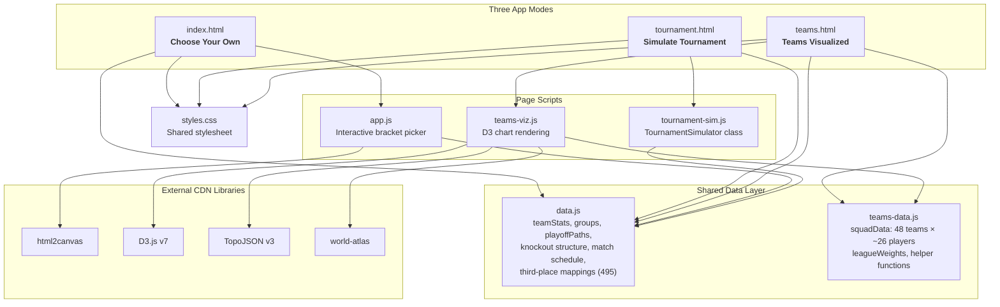
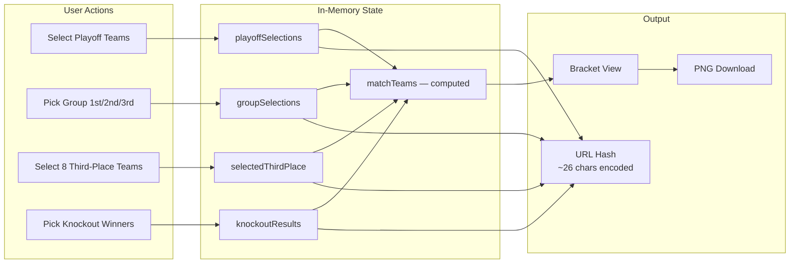
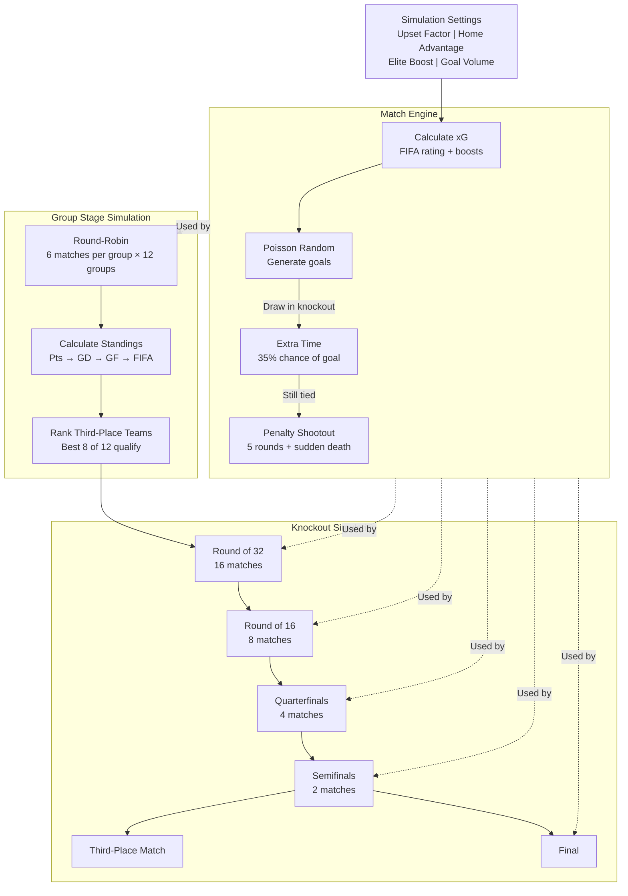
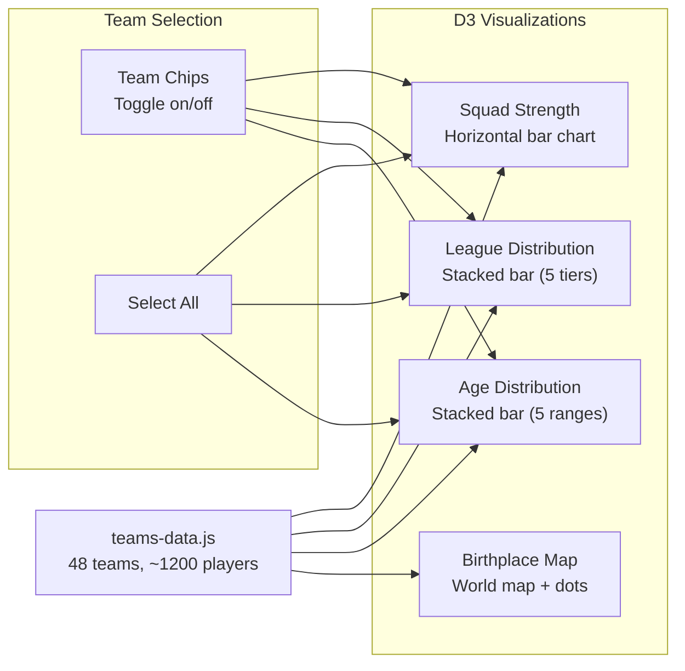
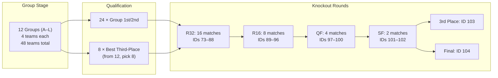
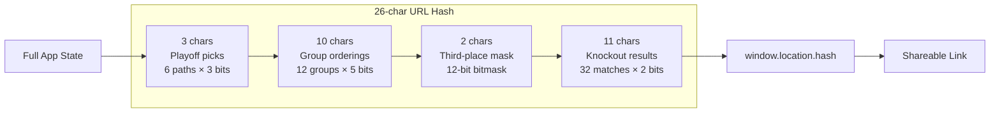

# Architecture

## System Overview

## Data Flow — Choose Your Own Mode

## Data Flow — Simulate Tournament Mode

## Data Flow — Teams Visualized Mode

## Tournament Bracket Structure

## URL State Encoding

